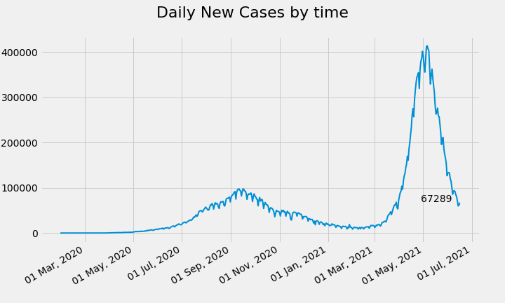
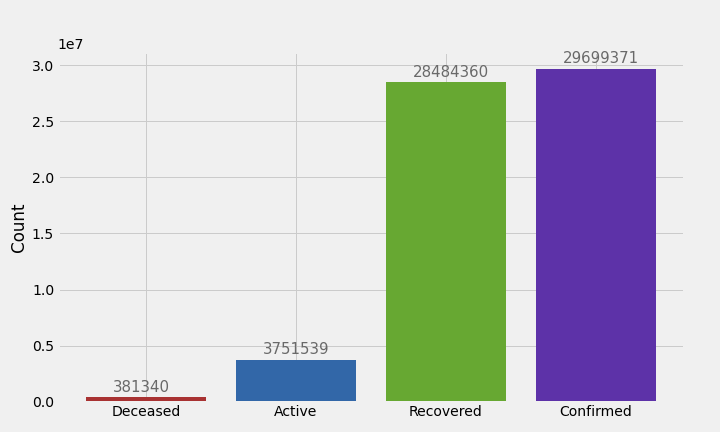
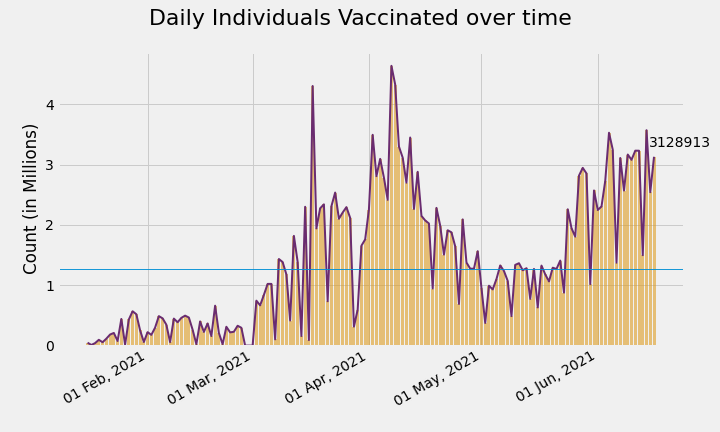
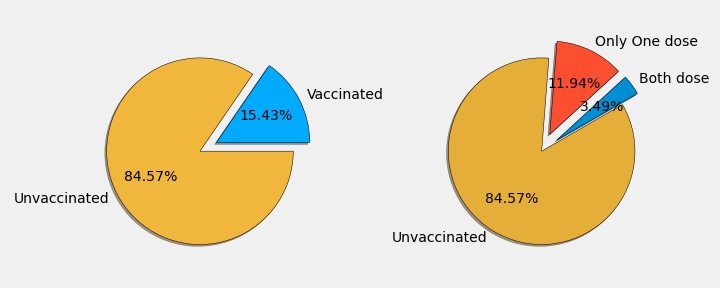

# India's COVID-19 analysis

Complete *exploratory* analysis of the **disease** and **vaccination** programme is done in notebook **[Indian_Complete_COVID-19_Analysis.ipynb](https://nbviewer.jupyter.org/github/Dhruv-praju/COVID-19-Tracker/blob/main/India/Indian_Complete_COVID-19_Analysis.ipynb)**.

[**Full report**](Indian_Complete_COVID-19_Analysis.html) without any code.

Dataset is collected from the [API](https://api.covid19india.org/).

#### Below are some visualizations from the notebook :

\
\

\
\

\
\

\
\

