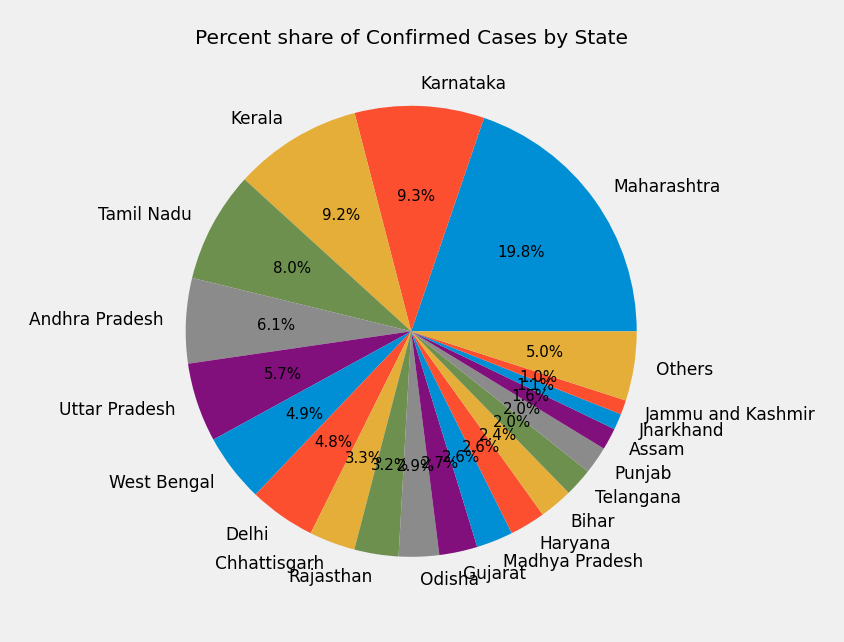
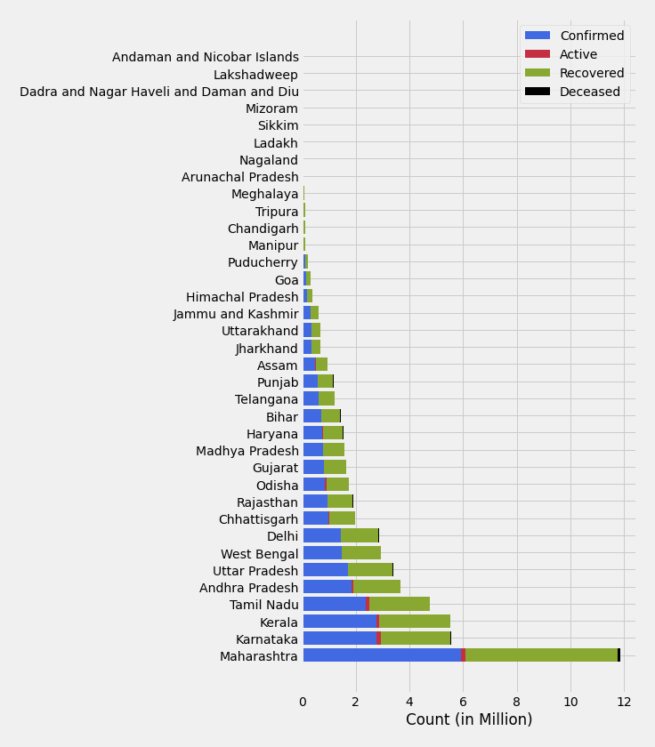
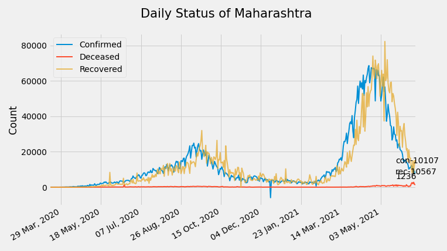
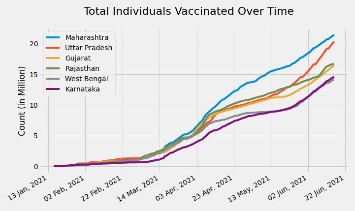

# State-wise COVID-19 analysis of India

Data **exploration** and **analysis** of Coronavirus spread in Indian states is done in [**State_wise_complete_analysis_of_COVID-19.ipynb**](State_wise_complete_analysis_of_COVID-19.ipynb) notebook.

Refer [this](State_wise_complete_analysis_of_COVID-19.html) for report without including code.

Data is used provided by this [API](https://api.covid19india.org/).

#### Here are few charts from the notebook :

\
\
\

\
\
\

\
\
\
