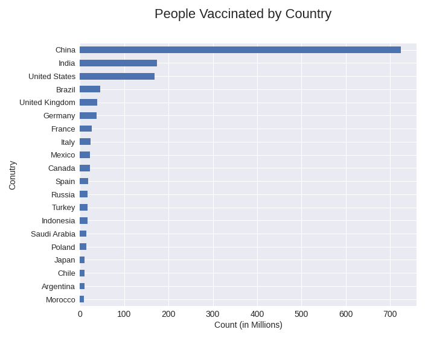
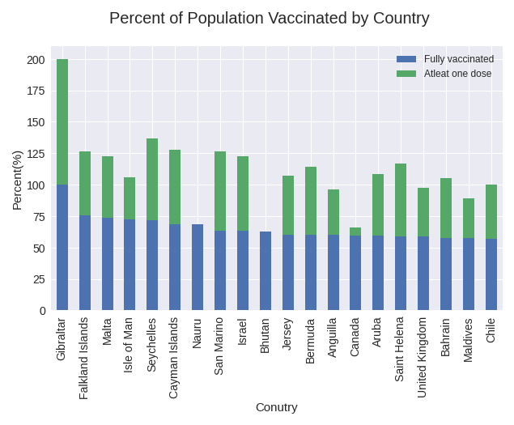
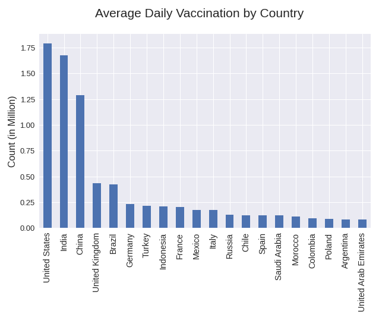

# World COVID-19 Vaccination analysis

[**This**](https://nbviewer.jupyter.org/github/Dhruv-praju/COVID-19-Tracker/blob/main/World/Vaccine_Data_Visualization_and_analysis.ipynb#World-COVID-19-vaccination-analysis) notebook explores the vaccination progress made by each country across the world through **global statistics** and visualizations.

**Data Cleaning** and **Filtering** is done in [**Vaccine_Data_Washing.ipynb**](https://nbviewer.jupyter.org/github/Dhruv-praju/COVID-19-Tracker/blob/main/World/Vaccine_Data_Washing.ipynb) notebook, after which cleaned data is stored in [cleaned_vaccinations.csv](cleaned_vaccinations.csv) .\
**Data Processing** along with statistics are in [**Vaccine_Data_Visualization_and_analysis.ipynb**](https://nbviewer.jupyter.org/github/Dhruv-praju/COVID-19-Tracker/blob/main/World/Vaccine_Data_Visualization_and_analysis.ipynb#World-COVID-19-vaccination-analysis) notebook.

Raw data was taken from *https://raw.githubusercontent.com/owid/covid-19-data/master/public/data/vaccinations/vaccinations.csv*.

#### Here are few visualizations from the notebook:

\
\
\
\

\
\
\
\
\

